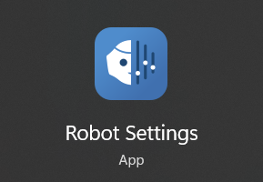
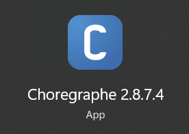

# Step by step to Set_Up_Dancing_NAO_Robot

## Step 1 Install required software

Install the following application: 
|Source |Application|
|---|---|
| https://www.aldebaran.com/en/support/nao-6/downloads-softwares ||
| https://www.aldebaran.com/en/support/nao-6/downloads-softwares| *Newer version*|

## Step 2 Connect NAO with a computer

Follow the instructions in the setup section of this site: [Follow the Getting Started Wizard | NAO 6 | Aldebaran](https://www.aldebaran.com/en/support/nao-6/4-follow-getting-started-wizard#article) 

## Step 3 Download choregraphe of NAO dancing

Download the Choregraphe folder name "openhouse" (This choregraphe file was developed by CamTech University Faculty of Engineering). There are two ways to download this file. 
|method 1| method 2|
|---|---|
|Download the folder from google drive: [Download choregraphe of NAO dancing](https://drive.google.com/drive/folders/1vgT5kHQXqBpfxL4CSeSAtagHvi6Xi8t4?usp=sharing) |Clone or download this repository "openhouse" folder. |

## Step 4 Deploy and Run NAO

Since you already have the Choregraphe software and the project file, here are the steps to set it up: 

1. Open Choregraphe: 
    + Launch the Choregraphe application on your computer. 
2. Connect to NAO: 

    + Ensure your NAO robot is powered on and connected to the same network as your computer. 
    + In Choregraphe, go to *Connection > Connect to....* 
    + Enter the IP address of your NAO robot and click Connect. 
3. Load Your Project: 
    + Click on File > Open... and navigate to the location of your project file. 
    + Select the file and click Open. 
4. Deploy and Run: 
    + Once your project is loaded, you can deploy it to NAO by clicking the Play button (green triangle) in the toolbar. 
    + You can also test your project in the Choregraphe simulator before deploying it to the actual robot. 

